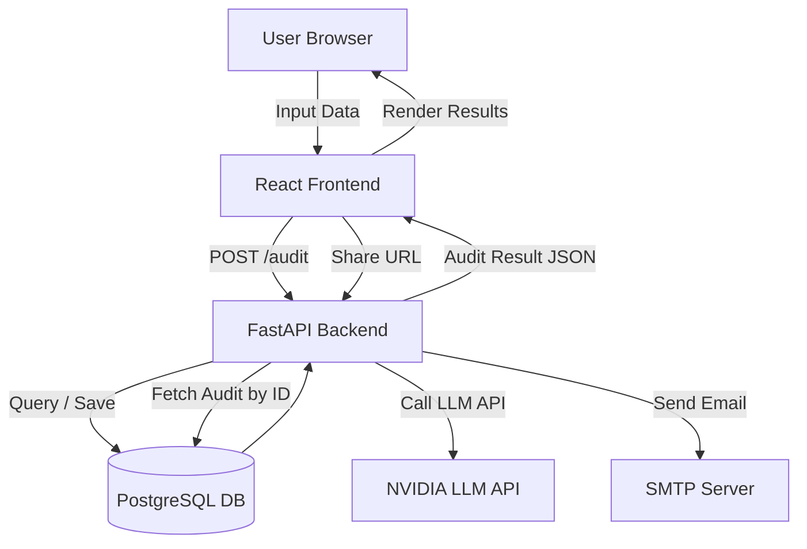

# 🏗️ ARCHITECTURE.md

## 📌 Overview

AI Spend Audit Tool is a full-stack web application that analyzes a user’s AI tool spending and provides actionable recommendations to reduce costs.

The system is designed with a **clear separation of concerns**:

* Frontend handles UI, input, and display
* Backend handles audit logic, persistence, and integrations
* Database stores audit results and lead data

---

## 🧩 System Architecture



---

## 🔄 Data Flow

### 1. User Input

* User enters:

  * AI tools
  * Plans
  * Monthly spend
  * Team size
  * Use case
* Data is stored in **localStorage** for persistence

---

### 2. Audit Request

* Frontend sends POST request:

```json
{
  "tools": [...],
  "team_size": 5,
  "use_case": "coding"
}
```

* Endpoint:

```
POST /audit
```

---

### 3. Audit Engine (Backend Core)

The backend processes:

* Pricing comparison
* Plan optimization
* Alternative tool suggestions
* Savings calculation

Output:

```json
{
  "total_monthly_savings": 120,
  "total_annual_savings": 1440,
  "recommendations": [...]
}
```

---

### 4. AI Summary Generation

* Backend sends structured audit data to NVIDIA LLM API
* Receives ~100-word summary
* If API fails:

  * Fallback → templated summary

---

### 5. Result Storage

* Audit result stored in PostgreSQL:

  * Unique ID generated
  * No sensitive data stored in public record

---

### 6. Lead Capture

* User submits email after seeing results
* Backend:

  * Stores lead in DB
  * Sends confirmation email via SMTP

---

### 7. Shareable URL

* Format:

```
/report/{audit_id}
```

* Public endpoint:

```
GET /report/{id}
```

* Returns:

  * Tool data
  * Savings
  * Recommendations
  * (No email / personal data)

---

## 🧱 Component Breakdown

### Frontend (React + TypeScript)

* Pages:

  * Landing Page
  * Input Form
  * Results Page
  * Shareable Report Page

* State Management:

  * useState + localStorage

* Responsibilities:

  * UI rendering
  * API calls
  * Form validation

---

### Backend (FastAPI)

* Core Modules:

  * `audit_engine.py` → business logic
  * `routes.py` → API endpoints
  * `models.py` → DB schema
  * `services/llm.py` → LLM integration
  * `services/email.py` → email sending

* Responsibilities:

  * Audit computation
  * Data validation
  * DB interaction
  * External API calls

---

### Database (PostgreSQL)

Tables:

**audits**

* id
* input_data (JSON)
* result_data (JSON)
* created_at

**leads**

* id
* email
* company (optional)
* role (optional)
* team_size
* audit_id

---

## ⚙️ Tech Choices (Why this stack?)

### React (TypeScript)

* Strong ecosystem
* Type safety improves reliability
* Fast UI iteration

---

### FastAPI (Python)

* High performance
* Async support
* Easy integration with APIs (LLM, email)

---

### PostgreSQL

* Structured + JSON support
* Reliable for production
* Easy to scale

---

### Netlify (Frontend)

* Simple deployment
* Fast CDN
* Great for React apps

---

### Railway (Backend)

* Easy Python deployment
* Built-in PostgreSQL support
* Environment variable management

---

### NVIDIA LLM API

* Free-tier friendly
* Used only for summary (not core logic)

---

## 🚀 Scalability Considerations (10k audits/day)

If scaling is required:

### Backend

* Move to containerized deployment (Docker)
* Use load balancer (NGINX)
* Add caching (Redis)

---

### Database

* Add indexing on audit_id
* Read replicas for scaling reads

---

### Queue System

* Offload:

  * LLM calls
  * Email sending
* Use Celery / Redis queue

---

### Rate Limiting

* Prevent abuse on:

  * Audit endpoint
  * Email submission

---

### CDN Optimization

* Cache static frontend assets globally

---

## 🔐 Security Considerations

* No secrets in frontend
* Use environment variables
* Strip personal data from public reports
* Basic rate limiting on APIs

---

## 🧠 Design Philosophy

* Keep audit logic **deterministic and explainable**
* Use AI only where it adds value (summary)
* Optimize for **user trust + clarity**
* Build like a real product, not a demo

---

## 📌 Future Improvements

* Benchmark comparison engine
* Multi-user dashboard
* SaaS billing integration
* Advanced analytics
